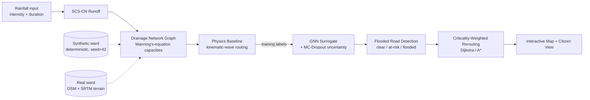

# Urban Flood Nowcasting System

**Team Expecto Patronum** &middot; Smart India Hackathon 2026 &middot; Problem
Statement SIH26085 (Ministry of Earth Sciences / NCMRWF)

## 1. What this is

This is a decision-support tool that predicts, street by street, where a
city ward will flood in the next 1&ndash;3 hours of a rainstorm, and then
tells emergency responders how to route around it &mdash; with a specific
alarm for when a hospital, fire station, or shelter has *no* remaining
flood-free way in or out. It runs against a deterministic offline demo
ward by default, and against a real Bengaluru neighbourhood (real roads,
real terrain, real hospitals) when you switch it into "real" mode.

## 2. The problem it solves

A rainfall heatmap tells you it's raining hard somewhere. It does not tell
you which *road* is impassable, whether the ambulance route to the
nearest hospital still works, or whether that hospital has become
completely cut off. Those are three different, harder questions, and
answering them requires more than rainfall data: you need the terrain
(where does water actually collect), the drainage network and its
capacity (how fast can that water be carried away before it backs up),
the road network (which streets does that affect), and a way to compare
routes under those constraints. This project builds that whole chain, not
just the first step of it &mdash; every stage below actually runs, on real
data when configured to, not just the rainfall input.

## 3. How it works

The system is a pipeline: rainfall goes in one end, a routing decision
comes out the other. Each stage's output is the next stage's input.

**Rainfall &rarr; Runoff.** A rainstorm is described by two numbers: its
intensity (mm/hr) and duration (minutes). Not all of that rain reaches the
drains &mdash; some soaks into the ground, depending on how paved the
surface is. We convert rainfall into the runoff that actually needs
somewhere to go using the **SCS Curve Number method** (SCS-CN): a
standard hydrology formula (from the US Department of Agriculture's
National Resources Conservation Service) that takes a rainfall depth and
a "curve number" &mdash; a 30&ndash;98 score describing how paved/impervious a
patch of ground is (dense pavement scores high, forest or parkland scores
low) &mdash; and outputs how much of that rain becomes surface runoff instead
of soaking in.

**Runoff &rarr; Drainage.** That runoff has to travel somewhere: into
storm drains, along roads, downhill, until it reaches a natural low point
(a channel, a lake, a culvert). We model the ward's drainage network as a
graph &mdash; nodes are drain junctions, edges are pipes or channels between
them, each with a carrying capacity computed from **Manning's equation**
(a standard hydraulics formula relating a pipe's diameter, slope, and
roughness to how much water it can carry per second). A simplified,
deterministic routing simulation (the "physics baseline") then pushes each
timestep's runoff volume through that graph, capped by each edge's
capacity, so that water backs up and ponds exactly where the network
can't keep up &mdash; the same behaviour a real storm drain network shows,
just without the computational cost of a full numerical hydraulic solver.

**Drainage &rarr; Flood Prediction.** Running that physics simulation from
scratch for every possible rainfall scenario in real time is too slow for
a live nowcast. So we train a **GNN** (Graph Neural Network &mdash; a neural
network architecture built to learn directly on graph-structured data,
here the drainage network graph) to *approximate* the physics
simulation's output, once, offline, then run it live in milliseconds. To
know how confident that approximation is at each point, we use **MC
Dropout** (Monte Carlo Dropout): the network's dropout regularization
(which normally randomly disables some connections only during training)
is kept switched on at prediction time too, so running the same
prediction ~20 times gives 20 slightly different answers &mdash; their spread
*is* the uncertainty band. A node the model is confident about gives
nearly identical answers every time; a node it's unsure about doesn't.

**Flood Prediction &rarr; Road Impact.** Each drainage node's predicted
water depth is spatially matched to the nearest road segments, which are
then classified clear (&lt;15cm predicted depth), at-risk (15&ndash;30cm), or
flooded (&gt;30cm) &mdash; the same three-tier classification a city's own
emergency operations centre would use.

**Road Impact &rarr; Rerouting.** With roads classified, we run two
shortest-path searches (Dijkstra's algorithm and A*, both standard
graph-routing algorithms) between an origin and a destination: one that
ignores flooding entirely (what a normal GPS app would give you) and one
that heavily penalizes flooded and at-risk roads so it detours around
them. Comparing the two is the product's core "wow moment" &mdash; and
separately, for every hospital, fire station, and shelter, we compute
whether *any* flood-free path still reaches it at all (see &sect;5).

## 4. What's real vs. synthetic

| Data | Status | Details |
|---|---|---|
| Ward elevation (terrain) | **Real**, real-mode only | Fetched automatically from AWS's public "Terrarium" elevation tiles (SRTM-derived, no API key needed). Synthetic mode uses a deterministic, seeded, hand-shaped terrain instead. |
| Road network | **Real**, real-mode only | Pulled live from OpenStreetMap via `osmnx`. Synthetic mode uses a fixed 8&times;8 grid + 2 diagonal arterials. |
| Critical infrastructure (hospitals/fire/shelter) | **Real**, real-mode only | Real, named OSM-tagged facilities (e.g. Apollo Hospital, Manipal Hospitals) for the real pilot ward. Synthetic mode uses fixed, clearly-labelled placeholder sites ("Ward Alpha..."). |
| Storm drain locations | **Inferred**, both modes | Real mode: a road is treated as drain-carrying if it's within 120m of an OSM-mapped waterway &mdash; a reasonable proxy, not a municipal drainage record (those aren't public). Synthetic mode: seeded random tagging. |
| Land use / curve numbers | **Synthetic**, both modes | No licensed land-use raster is used; both modes assign curve numbers by rule (zoning-like bands in synthetic mode, a flat residential default in real mode). |
| Rainfall scenarios & Live Nowcast | **Real & Live API** | Live Open-Meteo ensemble API for Bengaluru (`/api/weather/nowcast`) coupled with scenario presets (Low/Medium/Extreme) and custom rainfall intensity/duration sliders. |
| Multi-Route Dispatch | **Real & Physics-Penalized** | Evaluates 3 distinct route corridors (Recommended Safest, Shortest Impassable, Alternate Detour) across 4 vehicle profiles (Ambulance, Fire, Rescue, Police). |
| GNN training labels | **Synthetic**, both modes, always | Generated by our own physics-baseline simulation, run against whichever ward is active. Never a stand-in for observed real-world flooding. |
| Historical flood backtest | **Empty, intentionally** | The backtesting feature is fully built and wired up, but ships with zero invented events &mdash; see &sect;10. |

Full sourcing detail, including two real bugs the real-data integration
surfaced and how they were fixed, is in
[`docs/DATA_SOURCES.md`](docs/DATA_SOURCES.md).

## 5. Key features, and why they matter

**Uncertainty bands.** Every predicted flood depth comes with a
mean *and* a spread (via MC Dropout, &sect;3), shown as a shaded band on
the chart and a translucent overlay on the map. A flood prediction
presented as one confident number invites people to trust it past what
the model actually knows; showing the uncertainty is what makes the
prediction usable for a real decision instead of just impressive-looking.

**Critical-access routing.** Beyond "avoid the flooded road," we compute,
for every hospital, fire station, and shelter, how many *genuinely
independent* roads still connect it to the rest of the network under the
current flood state. When that number hits zero, a distinct red banner
fires &mdash; not folded into the ordinary rerouting UI &mdash; because "your
best route is 20 minutes slower" and "this hospital is unreachable" are
different severities of problem, and an emergency operations centre needs
to be able to tell them apart at a glance.

**Citizen view.** A second, separate, mobile-first page
(`/citizen`) answers one question for an ordinary resident, not an
operator: "is it safe near me right now?" It runs on the exact same
prediction pipeline as the operator dashboard &mdash; no separate, simplified
model &mdash; because the people who need the information most shouldn't get
a lower-fidelity version of it.

## 6. Screenshots


*The operator dashboard against the real Bellandur, Bengaluru pilot ward: real OpenStreetMap
roads and real named hospitals/fire stations (gold pins) over a live basemap, with the
flood-depth heatmap, uncertainty overlay, and road-state colouring all active.*


*The core "wow moment" under a Heavy Cloudburst scenario: the flood-aware route (20,732s)
against the naive baseline (201s) it would otherwise have taken, having avoided 11
flooded/at-risk segments the baseline route would have driven straight through.*

## 7. Architecture



See [`docs/ARCHITECTURE.md`](docs/ARCHITECTURE.md) for the stage-by-stage
breakdown and the synthetic/real data boundary in the code.

## 8. Tech stack

| Layer | Choice | Why |
|---|---|---|
| Backend API | FastAPI (Python) | Async-native, automatic OpenAPI docs, and Python keeps the API in the same language as the ML/GIS pipeline. |
| ML | PyTorch + PyTorch Geometric | PyG provides ready-made graph-convolution layers (GCNConv) so the GNN operates directly on the drainage graph. |
| GIS | geopandas, shapely, rasterio, networkx, osmnx | The standard, interoperable Python geospatial stack; osmnx specifically wraps OpenStreetMap's Overpass API for real road-network ingestion. |
| Database | PostGIS via Docker, with a SQLite fallback | PostGIS for a production-shaped stack; SQLite so the whole backend also runs with zero external services for local dev/demo. |
| Frontend | React + TypeScript + Vite | Fast dev iteration and a typed contract between the frontend and the FastAPI backend's schemas. |
| Map rendering | MapLibre GL JS + Deck.gl | MapLibre for a real, open-source basemap; Deck.gl layers on top for the GPU-accelerated flood heatmap, uncertainty overlay, and route paths. |
| State | Zustand | Minimal, hook-based global state without Redux's boilerplate, appropriate for this app's scale. |
| Charts | Recharts | Straightforward, composable charts for the uncertainty band and explainability panels. |

## 9. Setup

### Option A &mdash; Docker Compose (full stack, PostGIS)

```bash
docker-compose up
```

Backend: http://localhost:8000/docs &middot; Frontend: http://localhost:5173

### Option B &mdash; Zero-dependency local dev (no Docker needed)

```bash
# Backend
cd backend
python -m venv .venv && source .venv/Scripts/activate   # or .venv/bin/activate on macOS/Linux
pip install -r requirements.txt
python ../scripts/seed_synthetic_ward.py   # trains the synthetic-ward GNN checkpoint once
uvicorn app.main:app --reload

# Frontend (separate terminal)
cd frontend
npm install
npm run dev
```

`DB_MODE=sqlite` (the default) needs no PostGIS/Docker at all. Copy
`.env.example` to `backend/.env` to override any default.

### Switching to the real pilot ward (Bellandur, Bengaluru)

```bash
# in backend/.env
PILOT_MODE=real
REAL_WARD_BBOX=77.655,12.915,77.680,12.940
```

Restart the backend. On first boot it automatically fetches real
elevation data and the real road network/critical infrastructure for
Bellandur, and trains its own GNN checkpoint against that real topology
(a few seconds) &mdash; no manual downloads, no API keys, just network
access. See [`docs/DATA_SOURCES.md`](docs/DATA_SOURCES.md) for why
Bellandur, and exactly what "real" means there.

## 10. Current limitations

- **The GNN surrogate is not a certified hydraulic model.** It's trained
  to approximate our own simplified physics baseline, and its accuracy is
  reported against that baseline &mdash; never against observed real-world
  flooding, because no verified ground truth is available for either
  pilot ward.
- **No historical flood event is used for validation.** The backtesting
  feature (`GET /api/backtest/{event_id}`) is fully implemented but
  returns `501 Not Implemented` until a real, sourced, dated flood event
  is supplied &mdash; nothing was invented to fill that gap.
- **No live rainfall nowcast feed is connected.** Rainfall intensity and
  duration are direct user input (preset or slider), not pulled from
  IMD/NCMRWF or any other live weather source.
- **Land use / curve numbers aren't from a real land-use survey**, in
  either mode &mdash; a licensed LULC (land-use/land-cover) raster would
  replace the current zoning-like rules or flat default.
- **Storm drain locations in real mode are inferred, not municipal
  records**: a road counts as drain-carrying if it's near an
  OpenStreetMap-mapped waterway, which is a reasonable proxy but not the
  same as actual civic infrastructure data (which isn't publicly
  available for this area).
- **The GNN trains on very little data** (32 scenarios) and, on real,
  irregular road topology, only a small fraction of nodes ever see
  meaningful flooding in that training sweep &mdash; a real, documented
  class-imbalance problem that a depth-weighted training loss mitigates
  but doesn't eliminate. Reported error metrics between the synthetic and
  real wards are not directly comparable as a result (see
  `docs/DATA_SOURCES.md`).
- **Catchment-area assignment is a coarse nearest-node split**, not real
  watershed delineation. On irregular real road networks this can
  under/over-estimate a specific junction's contributing area; a floor
  value prevents physically absurd results but doesn't make the method
  precise.
- **The synthetic ward's flood-prone siting is deliberate, not random.**
  The demo hospital and fire station are intentionally placed near the
  ward's one real drainage chokepoint to make the critical-access-risk
  feature demonstrable within realistic rainfall &mdash; documented in full
  in `docs/DATA_SOURCES.md`, not hidden.

## 11. Team

**Team Expecto Patronum** &middot; Smart India Hackathon 2026 &middot;
Problem Statement SIH26085, sponsored by the Ministry of Earth Sciences /
NCMRWF.

---

See also: [`docs/ARCHITECTURE.md`](docs/ARCHITECTURE.md) (pipeline
detail), [`docs/DATA_SOURCES.md`](docs/DATA_SOURCES.md) (full data
provenance table and tuning history), [`docs/DEMO_SCRIPT.md`](docs/DEMO_SCRIPT.md)
(run-of-show), [`docs/JUDGE_QA.md`](docs/JUDGE_QA.md) (prepared honest
answers to hard questions).

### Testing

```bash
cd backend
pytest --cov=app --cov-report=term-missing
```

### License

MIT (see `LICENSE`).
# sih-flood-nowcast-2
