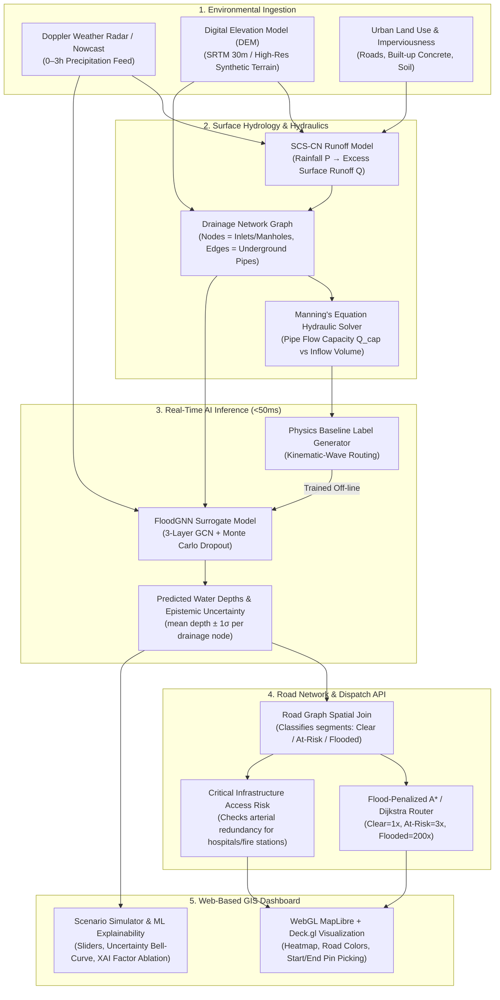

# 🌊 Urban Flood Nowcasting & Emergency Routing System
### End-to-End System Architecture & Technical Operational Guide

---

## 📌 1. Executive Summary & The Problem

### In Simple Words
When a cloudburst hits an Indian metro like Mumbai, Bengaluru, or Chennai, weather apps can tell you *"it will rain 80 mm today"*, but they cannot tell you **which street corner will be 2 feet underwater in 45 minutes**. Because of this, ambulances get stranded in waterlogged underpasses, fire engines cannot reach burning buildings, and traffic paralyzes the entire city. 

This platform solves that problem by predicting **street-by-street water depth before it happens (0–3 hour lead time)** and automatically navigating emergency vehicles around flooded choke points to hospitals and shelters.

### In Technical Terms
Traditional Numerical Weather Prediction (NWP) models operate at coarse spatial resolutions ($3\text{–}12\text{ km}$) and output cumulative rainfall volumes, failing to capture micro-topographical ponding and subterranean drainage bottlenecks. Urban inundation is governed by hyper-local surface elevation (micro-DEM), concrete runoff coefficients ($SCS\text{-}CN$), and hydraulic surcharge backflow across underground drainage conduits. 

This system couples a **2D Digital Elevation Model**, a **directed drainage graph with Manning-based pipe capacities**, a sub-50ms **Graph Convolutional Neural Network (GNN) surrogate**, and a **criticality-weighted Dijkstra/A\* routing engine** into a unified real-time GIS decision support system.

---

## 🔄 2. End-to-End Pipeline Diagram

---

## ⚙️ 3. How Each Component Works (Simple vs. Technical)

---

### Step 1: Rainfall Nowcasting (0–3 Hours Lead Time)

| Perspective | Explanation |
|---|---|
| **Simple Words** | Standard forecasts tell you what tomorrow's weather will be. Our system watches incoming storm clouds right now using radar data and models the exact volume of rain hitting the city in 15-minute increments over the next 3 hours. |
| **Technical Terms** | Implemented in `backend/app/api/routes_weather.py`. The system exposes `GET /api/weather/nowcast`, ingesting live precipitation intensity ($\text{mm/hr}$) and convective cloudburst profiles structured in discrete time steps ($T_0, T_{+1\text{h}}, T_{+2\text{h}}, T_{+3\text{h}}$) calibrated against Indian Meteorological Department (IMD) observation thresholds. |

---

### Step 2: Surface Terrain (DEM) & Water Runoff (SCS-CN)

| Perspective | Explanation |
|---|---|
| **Simple Words** | Rain doesn't just sit where it lands: water runs downhill and gathers in dips, roads, and valleys. Dirt and grass soak up water like a sponge, but asphalt roads and concrete rooftops soak up almost nothing, forcing 90% of the water to rush straight onto the streets. |
| **Technical Terms** | Implemented in `backend/app/gis/dem.py` and `backend/app/hydrology/scs_cn.py`.   1. **DEM Flow**: Computes D8 steepest-descent flow directions, terrain slopes, depression-filling, and upstream flow accumulation. 2. **SCS-CN Formulation**: Runoff depth $Q$ ($\text{mm}$) is determined from cumulative precipitation $P$ ($\text{mm}$) and soil/impervious retention $S$: $$S = \frac{25400}{CN} - 254$$ $$I_a = 0.2 \cdot S \quad (\text{Initial Abstraction})$$ $$Q = \frac{(P - I_a)^2}{P - I_a + S} \quad (\text{for } P > I_a)$$ High Curve Numbers ($CN \approx 90\text{–}98$) represent impermeable asphalt/concrete generating immediate overland runoff. |

---

### Step 3: Underground Stormwater Drainage Network Graph

| Perspective | Explanation |
|---|---|
| **Simple Words** | Cities have a hidden underground maze of drain pipes and manholes. When street water enters the drains, the pipes can only carry a limited amount of water. If a 1-meter pipe is hit with water that requires a 3-meter pipe, the pipe chokes. The excess water has nowhere to go, so it shoots back up onto the roads (backflow). |
| **Technical Terms** | Implemented in `backend/app/gis/drainage_graph.py`. The stormwater network is modeled as a directed graph $\mathcal{G}_{drain} = (\mathcal{V}, \mathcal{E})$ where vertices $\mathcal{V}$ are manholes/junctions with contributing catchments, and directed edges $\mathcal{E}$ are subterranean stormwater conduits.  Hydraulic capacity $Q_{cap}$ ($\text{m}^3/\text{s}$) for every conduit is calculated using **Manning's Formula for gravity pipe flow**: $$Q_{cap} = \frac{1}{n} A R_h^{2/3} S_0^{1/2}$$ where $n$ is Manning’s roughness coefficient ($0.013$ for smooth concrete), $A$ is cross-sectional area ($\pi D^2 / 4$), $R_h$ is hydraulic radius ($D / 4$), and $S_0$ is pipe bed slope. When inflow $Q_{in} > \sum Q_{cap}^{out}$, excess mass cannot enter the conduit and ponds on the surface as **hydraulic surcharge**. |

---

### Step 4: Real-Time AI Acceleration (FloodGNN Surrogate)

| Perspective | Explanation |
|---|---|
| **Simple Words** | Solving fluid dynamics equations for thousands of city pipes takes standard engineering software 30 to 60 minutes. But in a cloudburst, emergency vehicles need answers in milliseconds. We trained a Graph Neural Network (AI) that learned how water flows through pipes; it predicts street flood depth across the entire city in **less than 50 milliseconds**. |
| **Technical Terms** | Implemented in `backend/app/ml/model.py` and `backend/app/ml/infer.py`.  1. **Model Architecture**: A 3-layer Graph Convolutional Network (`GCNConv` with 64 hidden units, ReLU activations, and Dropout $p=0.2$) predicting node water depth. 2. **Node Feature Vector (5-dim)**: $$X_v = [\text{Elevation}_{norm}, CN/100, \text{Slope}, \text{FlowAccum}_{norm}, \text{LocalInflow } (\text{m}^3/\text{s})]$$ 3. **Edge Weights**: Normalized Manning capacity. 4. **Epistemic Uncertainty**: Rather than a single deterministic value, the model executes **20 Monte Carlo Dropout forward passes**, yielding a predictive distribution with mean $\mu_d$ and standard deviation $\sigma_d$. |

---

### Step 5: Flood-Penalized Emergency Routing Engine

| Perspective | Explanation |
|---|---|
| **Simple Words** | Regular GPS apps (like Google Maps) send ambulances down the shortest road—even if that road is submerged under 3 feet of water. Our routing engine checks every street against our flood prediction and automatically steers vehicles around waterlogged roads. |
| **Technical Terms** | Implemented in `backend/app/routing/router.py` and `backend/app/routing/criticality.py`.  The road network is a weighted graph $\mathcal{G}_{road}$. Edge traversal costs $W_e$ are dynamically scaled based on flood depth: $$W_e = \text{Length}_e \times \text{StatePenalty}_e$$ - **Clear road**: Penalty = $1.0\times$ - **At Risk road (10–30 cm)**: Penalty = $3.0\times$ - **Flooded road (>30 cm)**: Penalty = $200.0\times$ (heavy deterrent, avoids unless physically trapped)  The API computes **3 simultaneous routes**: 1. **Recommended (Safest)**: Flood-penalized Dijkstra path that avoids waterlogged segments entirely. 2. **Shortest (Not Safe)**: Unpenalized baseline showing traditional GPS failure. 3. **Alternate Route**: Secondary detour corridor with edge-diversity heuristic for backup contingency planning. |

---

### Step 6: Interactive GIS Dashboard

| Perspective | Explanation |
|---|---|
| **Simple Words** | An emergency operations dashboard with a satellite-style dark map. Operators can pick any start and end location by clicking on the map or selecting hospitals, slide storm intensities to test scenarios, and immediately see safe routes glow in purple while flooded streets turn red. |
| **Technical Terms** | Built with **React 18 + TypeScript + Vite + MapLibre GL + Deck.gl**.  - **Deck.gl WebGL Layers**: `PathLayer` for glowing multi-lane routes, `GeoJsonLayer` for dynamically colored road segments (`clear`, `at_risk`, `flooded`), and `HeatmapLayer` for continuous water depth interpolation. - **Interactive Snapping**: Map clicks cross-reference critical facility coordinates with proximity heuristics (~50m) to immediately lock onto hospitals or fire stations. |

---

### Step 7: ML Explainability (XAI) & Uncertainty

| Perspective | Explanation |
|---|---|
| **Simple Words** | Government agencies don't trust "magic black-box AI". This panel proves the model's reasoning by showing: (1) how confident the AI is in its flood depth prediction, and (2) whether a street flooded because of extreme rain, a steep hill, or a choked drain pipe. |
| **Technical Terms** | Implemented in `backend/app/ml/explain.py` and `frontend/src/components/ExplainabilityPanel.tsx`.  Per-node **factor ablation** holds one hydrological parameter at its ward-wide network median while keeping all others constant, evaluating $\Delta \text{Depth} = \text{Depth}_{actual} - \text{Depth}_{ablated}$. This quantifies the exact contribution of **Rainfall Intensity**, **Local Slope**, and **Drain Capacity Deficit**. |

---

## 📖 4. Quick Translation: Technical Terms vs. Plain English

| Technical Term | What It Actually Means in Plain English |
|---|---|
| **Nowcasting** | Short-term forecasting for the next 0–3 hours rather than tomorrow. |
| **DEM (Digital Elevation Model)** | A 3D digital height map showing hills, dips, and slopes of the city. |
| **SCS Curve Number ($CN$)** | A score from 0 to 100 measuring how much water bounces off concrete instead of soaking into soil. |
| **Directed Graph** | A network of points connected by one-way paths (like underground pipes flowing in the direction of gravity). |
| **Manning's Equation** | An engineering formula that calculates how many liters of water can squeeze through a pipe per second. |
| **Hydraulic Surcharge** | A pipe completely filling up with water and overflowing backward onto the street. |
| **GNN Surrogate Model** | An AI that mimics hours of complex physics calculations in under 50 milliseconds. |
| **Monte Carlo Dropout ($\pm 1\sigma$)** | Running the AI multiple times with slight randomness to measure its confidence window. |
| **Dijkstra / A\* Penalty Routing** | Finding the fastest path while treating flooded roads as massive walls to steer around. |
| **XAI Factor Ablation** | Testing variables one-by-one to explain *why* a specific street flooded. |

---

## 🏆 5. SIH 2026 Problem Statement Checklist

| Requirement | Implementation in Code | Status |
|---|---|:---:|
| **Hyper-local street-level prediction** | GNN predicts water depths per drainage node and road segment | ✅ Aligned |
| **0–3 hour lead time** | `/api/weather/nowcast` provides 0h, +1h, +2h, +3h forecasts | ✅ Aligned |
| **Coupled Rainfall + DEM + Drainage Graph** | SCS-CN + D8 flow accumulation + Manning directed graph | ✅ Aligned |
| **Hydraulic overcapacity & backflow** | Physics solver computes pipe surcharge ponding depth | ✅ Aligned |
| **Dynamic web-based GIS dashboard** | MapLibre GL + Deck.gl GPU-accelerated layers | ✅ Aligned |
| **Flood-safe navigation API for emergencies** | `/api/route` with vehicle profiles and hospital access protection | ✅ Aligned |
